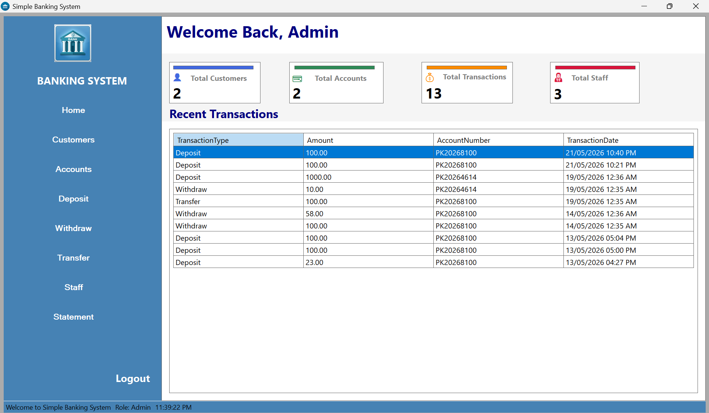
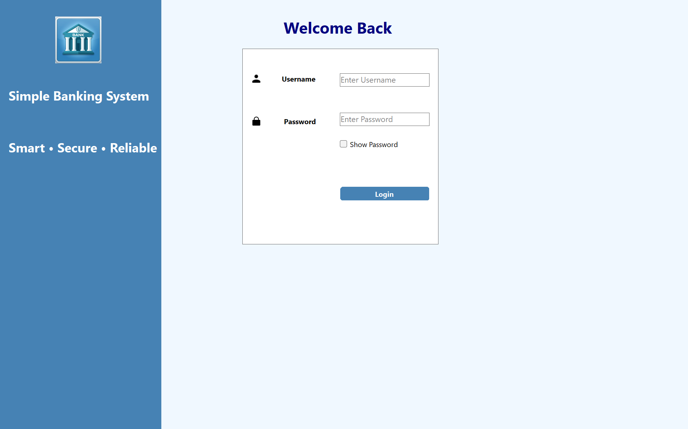

# Simple Banking System

A professional Banking Management System built using C# WinForms and SQL Server.
## Screenshots

### Dashboard

### Login

## Features

- Login Authentication
- Password Hashing
- Customer Management
- Account Management
- Deposit System
- Withdraw System
- Transfer System
- Transaction Statements
- Receipt Generation
- Dashboard Analytics

## Technologies Used

- C#
- WinForms
- SQL Server
- ADO.NET

## Developer

Muhammad Shahzad Latif
